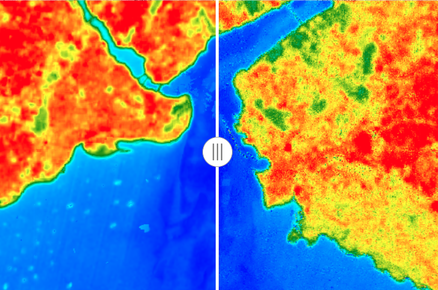

# High-Resolution Land Surface Temperature (LST) Downscaling: Istanbul Case Study



## Project Overview
This project focuses on downscaling **Land Surface Temperature (LST)** data from **Landsat 8 (30m)** to **Sentinel-2 resolution (10m)** using Machine Learning techniques on **Google Earth Engine (GEE)**. The study area is **Istanbul**, a complex metropolitan city characterized by significant thermal heterogeneity.

By fusing thermal data with high-resolution optical indices, I aim to reveal urban heat island micro-structures that are invisible in standard satellite products.

## Key Results
I compared the traditional **Multiple Linear Regression (MLR)** approach with a **Random Forest (RF)** model.

| Model | RMSE (Error) | R² (Accuracy) | Improvement |
|-------|--------------|---------------|-------------|
| **MLR (Baseline)** | 2.628 K | 0.925 | - |
| **Random Forest (Ours)** | **2.149 K** | **0.950** | **~18.2%** |

### Physical Validation (Energy Conservation)
To ensure physical consistency, the 10m downscaled map was re-aggregated to 30m and compared with the original Landsat LST.
* **Mean Bias:** `0.000 K` (Perfect Energy Conservation)
* **Method:** A residual correction step was applied to preserve the total thermal energy of the original image.

---

## Critical Analysis & Scientific Honesty
While standard validation metrics show high performance ($R^2 > 0.9$), I performed a rigorous **"Land-Only Spatial Block Cross-Validation"** to test the model's true generalization capability.

* **The Challenge:** Standard random sampling often inflates accuracy due to spatial autocorrelation and the distinct thermal signature of water bodies.
* **The Stress Test:** When water bodies were excluded and 10km spatial blocks were used for validation, the $R^2$ dropped to ~0.27 for both models.
* **Conclusion:** Even under these harsh conditions, the **Random Forest model consistently outperformed MLR**, proving its robustness in capturing complex non-linear relationships in urban environments.

---

## Methodology
1.  **Data Acquisition:** Landsat 8 (Thermal) & Sentinel-2 (Optical) collections (Summer 2023).
2.  **Preprocessing:** Cloud masking, geometric alignment, and calculation of spectral indices (NDVI, NDBI, NDWI).
3.  **Modeling:** * Training a **Random Forest Regressor (300 Trees)**.
    * Predictors: Spectral indices + Raw Sentinel-2 bands (B2, B3, B4, B8).
4.  **Validation:** * Standard Random Split (70/30)
    * Energy Conservation Test (Residual Analysis)

## Usage
This project uses the Python API of Google Earth Engine (`geemap`).

## References
Onačillová, K., et al. (2022). Combining Landsat 8 and Sentinel-2 Data in Google Earth Engine to Derive Higher Resolution Land Surface Temperature Maps.


```python
# Clone the repository
git clone [https://github.com/tarikmacto-sm/LST-Downscaling-GEE-Istanbul.git](https://github.com/tarikmacto-sm/LST-Downscaling-GEE-Istanbul.git)

# Install dependencies
pip install geemap earthengine-api


